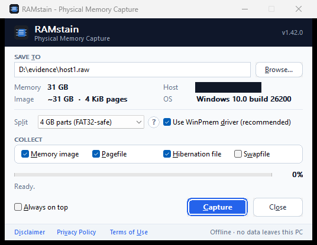

# RAMstain

A small, offline **RAM capture** tool for Windows, for forensics and incident
response.

No account, no email, no registration, no network. One portable EXE: run it,
pick where to save, click **Capture**.

<p align="center">
  
</p>

## Why RAMstain?

[WinPmem](#credits) is an excellent, trusted memory imager, but it is
**command-line only**: there is no GUI version. In the field, that means
opening an elevated prompt, remembering the right syntax, then hashing the
image, writing up the details, and splitting it for a FAT32 drive, all by
hand, often under time pressure.

RAMstain puts a simple window on top of WinPmem, so a capture is **point and
click**: choose where to save, click **Capture**, and get the image, its
SHA-256 hash, a ready-made evidence note (`.meta`) and a run log in one go.
The goal is to save forensic analysts time and avoid mistakes, not to replace
WinPmem.

---

## Features

- **Portable single EXE** (~900 KB). No installer, no runtime to install. The
  signed [WinPmem](#credits) imager is built in.
- **Offline.** No network calls, no telemetry, no updates.
- **Evidence-ready output.** A `.raw` image plus a `.meta` sidecar with host,
  OS, timestamp, size and SHA-256, and a timestamped `.log` of the whole run.
- **Copy hashes** from the result window in `sha256sum` format, for case notes
  or later verification.
- **Split images** into 1–16 GB parts (`.001`, `.002`, …), including a
  FAT32-safe 4 GB option.
- **Live progress** for the capture and the hashing step, with **Stop** at any
  time (the partial image is kept).
- **Pagefile / hibernation file / swapfile collection:** optionally collect
  `pagefile.sys`, `hiberfil.sys` and `swapfile.sys` alongside the memory image,
  or on their own, each with its own SHA-256 and `.meta` sidecar.
- **Safety checks:** overwrite prompt, free-space check, and a warning if you
  close the window during a capture.

## Usage

Run `RAMstain.exe` (it asks for Administrator rights), choose the output path,
and click **Capture**. When it finishes you get a summary with size, time,
speed and SHA-256. **Copy hashes** puts the SHA-256 of every file from the run
on the clipboard in `sha256sum` format (`<hash>  <file name>`), ready to paste
into case notes or to check later with `sha256sum -c` in the output folder.

### Keyboard

Everything works without a mouse. **Tab / Shift+Tab** move between controls,
**Space** or **Enter** presses the focused button, and underlined letters work
with **Alt**:

| Keys | Action |
|------|--------|
| Alt+C | Capture |
| Alt+O / Alt+S | Close / Stop (during a capture) |
| Alt+T | Save-to path field |
| Alt+B | Browse… |
| Alt+L | Split drop-down |
| Alt+D | Use WinPmem driver |
| Alt+M | Collect memory image |
| Alt+P | Collect pagefile.sys |
| Alt+H | Collect hiberfil.sys |
| Alt+W | Collect swapfile.sys |
| Alt+A | Always on top |
| Alt+I / Alt+V / Alt+U | Disclaimer / Privacy Policy / Terms of Use |
| F1 | About |
| Esc | Close the open dialog, or quit (asks first during a capture) |

In dialogs, Enter presses the highlighted button and Esc cancels.

### Command line

```
RAMstain.exe "D:\evidence\host1.raw"      pre-fill the save path
RAMstain.exe --split 4095                 preselect split size in MB
RAMstain.exe --driver "C:\tools\winpmem.exe"   use an external imager instead of the built-in one
RAMstain.exe --no-driver                  select the experimental driverless method
RAMstain.exe --pagefile                   also collect pagefile.sys
RAMstain.exe --hiberfil                   also collect hiberfil.sys
RAMstain.exe --swapfile                   also collect swapfile.sys
RAMstain.exe --system-files               also collect pagefile, hibernation file and swapfile
RAMstain.exe --no-memory --system-files   system files only, no memory image
RAMstain.exe --selftest "C:\out\test.raw" 512 MB synthetic test, no real memory read
RAMstain.exe --help                       list the options (also -h, /?)
```

Options only preselect the window's settings; the capture starts when you
click **Capture**. An unknown option shows the help instead of starting.

`--help` prints to the console when it can: redirected output
(`RAMstain.exe --help > help.txt`, or piped) or an elevated prompt. From a
normal prompt, Windows starts RAMstain elevated in a new process with no
console, so the help appears in a message box instead.

An external imager can also be set with the `RAMSTAIN_WINPMEM` environment
variable. Both the classic WinPmem 2.x and the Go imager (`go-winpmem`) work.

## Output

| File | Contents |
|------|----------|
| `<name>.raw` | Physical memory image. With splitting: `<name>.001`, `<name>.002`, … |
| `<name>.meta` | Image path, host, OS/kernel, capture start and finish (UTC and local), size, SHA-256, tool version, method, and per-part hashes when split. |
| `<name>.log` | Run log: a timestamped (UTC, millisecond) record of each run — host, user, command line, options, every step (imager start and exit code, hashing, splitting, each system file and how it was read), errors, and the final results with their SHA-256. Written as the run happens, so it survives an interrupted run; later runs to the same name are appended. |
| `<name>__pagefile.raw` + `.meta` | Collected pagefile (if requested), with its own size, SHA-256 and source path. |
| `<name>__hiberfil.raw` + `.meta` | Collected hibernation file (if requested), same sidecar format. |
| `<name>__swapfile.raw` + `.meta` | Collected swapfile (if requested), same sidecar format. |

Example `host1.meta`:

```
RAMstain capture metadata
=========================
Image:       D:\evidence\host1.raw
Host:        WS-FORENSICS-01
OS:          Windows 10.0 build 26200
Kernel:      NT 10.0.26200
Started:     2026-09-28T08:36:14Z  (local 2026-09-28 16:36:14 UTC+08:00)
Finished:    2026-09-28T08:42:51Z  (local 2026-09-28 16:42:51 UTC+08:00)
Size:        34359738368 bytes
Pages:       8388608 x 4096 bytes
SHA-256:     adc0a545e4ddbfc76f87b9eca80d0ab066bf9f9dd1f8390e1306f85a7bbf84fa
Tool:        RAMstain 1.42.0
Method:      WinPmem kernel driver (WinPmem 2.x, embedded, Velocidex signed driver)
```

The hash is computed in one pass over the image. A stopped capture keeps
its partial image but gets no hash.

## Splitting large images

Pick a part size in the **Split** drop-down (or use `--split <MB>`). The parts
use the `.001`, `.002`, … naming that FTK Imager, X-Ways and Autopsy open
directly. Choose **4 GB parts (FAT32-safe)** for FAT32 USB drives.

The image is split in place after capture, so the extra disk space needed is
only one part. The `.meta` file lists each part with its own SHA-256; the
main hash covers the whole image. To rejoin:

```
copy /b host1.001 + host1.002 + host1.003 host1.raw
```

List the parts explicitly: `copy /b host1.0*` can join them in the wrong order
on FAT32/exFAT drives. The **?** button next to the Split drop-down shows these
steps in the app, including a PowerShell one-liner for many parts and the
Linux/macOS `cat` command.

## Collecting the pagefile, hibernation file and swapfile

Tick **Pagefile**, **Hibernation file** and/or **Swapfile** in the **Collect**
group (or pass `--pagefile` / `--hiberfil` / `--swapfile` / `--system-files`) to
copy `pagefile.sys`, `hiberfil.sys` and `swapfile.sys` (the swap file for
Store apps) to the same folder as the memory image, right after the capture.
Each copy's size, path and SHA-256 are shown when it finishes and recorded in
its `.meta` sidecar.

To collect only these files, untick **Memory image** (or pass `--no-memory`).
No memory image is written, and the WinPmem driver and Split options do not
apply. The files are named after the save path, e.g. `host1__pagefile.raw`.

- No kernel driver is needed. Windows keeps these files open with no sharing,
  so even an Administrator cannot open them normally; RAMstain locates the
  file's clusters in the NTFS master file table and reads them directly from
  the volume, computing SHA-256 in the same pass. They are live files, so the
  copy reflects their contents at the time each part is read. The volume must
  be NTFS.
- The pagefile is located from the system's `ExistingPageFiles` setting (it may
  live on any volume); the hibernation file and swapfile from the system
  volume. If a file does not exist (the pagefile or hibernation is disabled, or
  Windows has not created a swapfile), the run notes it and writes a `.meta`
  sidecar recording that nothing was collected.
- Collection is independent of the memory capture: a system file is still
  collected (and reported) even if the memory image itself fails or is
  stopped. Stopping during collection discards the partial system file.

## How it captures

Reading physical memory on Windows requires a kernel driver. RAMstain uses the
signed WinPmem driver:

1. On the first capture, the built-in imager is written to a temporary folder
   (`%TEMP%\RAMstain-<pid>\`) that only Administrators can access.
2. The imager loads its driver, writes the image, and unloads the driver.
3. When RAMstain closes, the temporary folder is deleted.

If a capture produces no image, security software or a driver-blocking policy
(such as HVCI or the vulnerable-driver blocklist) may have stopped the driver
from loading. Check Event Viewer.

**Driverless mode (experimental).** Unticking **Use WinPmem driver** tries
`OpenProcess(-1)` + `ReadProcessMemory`. This is not a documented Windows API
and fails on current Windows (error 87). It is kept only for testing.

---

## Building

Requires **Visual Studio 2022** with the C++ desktop workload (x64).

```bat
build.bat            :: Release  ->  x64\Release\RAMstain.exe
build.bat Debug      :: Debug    ->  x64\Debug\RAMstain.exe
```

Or open `RAMstain.sln` and build **Release | x64**.

Each build bumps the minor version in `src\version.h` (via
`scripts\bump-version.ps1`). Edit that file to change the major version.

### Repository layout

```
src/                  application source (RAMstain.cpp, resources, legal text)
scripts/              build helpers (version bump)
third_party/winpmem/  embedded WinPmem imager, its license, and provenance notes
build.bat             build wrapper
LICENSE               MIT license (RAMstain)
```

---

## Credits

RAMstain is built on **[WinPmem](https://github.com/Velocidex/WinPmem)**, the
open-source Windows memory imager by **Michael Cohen**, maintained by
**[Velocidex](https://github.com/Velocidex)**. WinPmem does the actual work of
reading physical memory through its signed kernel driver; RAMstain adds the
interface, integrity hashing, evidence sidecar, run log, image splitting and
system-file collection.

The embedded imager is WinPmem 2.0.1, signed by Velocidex Innovations, and is
included unmodified under the [Apache License 2.0](third_party/winpmem/LICENSE)
(Copyright 2012 Michael Cohen). The license text is also shown in the app under
**Terms of Use**. Thank you to the WinPmem authors and contributors.

## Legal and privacy

RAMstain is provided **as is**, for qualified professionals on systems they
are authorized to access. Capturing memory without authorization may be
unlawful.

RAMstain collects and sends nothing. Memory images can contain passwords,
keys and personal data, so treat them as highly sensitive.

The Disclaimer, Privacy Policy and Terms of Use are built into the app (see
the footer links) and kept in [`src/legal.h`](src/legal.h).

## License

RAMstain is released under the [MIT License](LICENSE).
Copyright (c) 2026 RAMstain contributors.

The embedded WinPmem imager is not covered by the MIT License; it remains
under its own [Apache License 2.0](third_party/winpmem/LICENSE).
